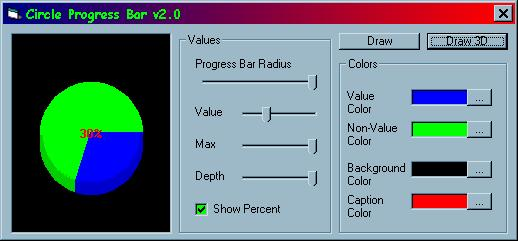



## Circle Progressbar v2\.0

### Description

basicly the same as the previous EXCEPT!

it has a new 3D progressbar option.

and yet again most or all properties of the progressbar are customizable. even the depth. PLEASE VOTE AND COMMENT(good/bad) !!!!!
 
### More Info
 

             |
---                |---
**Submitted On**   |2002-03-20 20:01:26
**By**             |[poop\_4\_brains](https://github.com/Planet-Source-Code/PSCIndex/blob/master/ByAuthor/poop-4-brains.md)
**Level**          |Intermediate
**User Rating**    |4.5 (50 globes from 11 users)
**Compatibility**  |VB 6\.0
**Category**       |[Graphics](https://github.com/Planet-Source-Code/PSCIndex/blob/master/ByCategory/graphics__1-46.md)
**World**          |[Visual Basic](https://github.com/Planet-Source-Code/PSCIndex/blob/master/ByWorld/visual-basic.md)
**Archive File**   |[Circle\_Pro639593202002\.zip](https://github.com/Planet-Source-Code/poop-4-brains-circle-progressbar-v2-0__1-32909/archive/master.zip)

